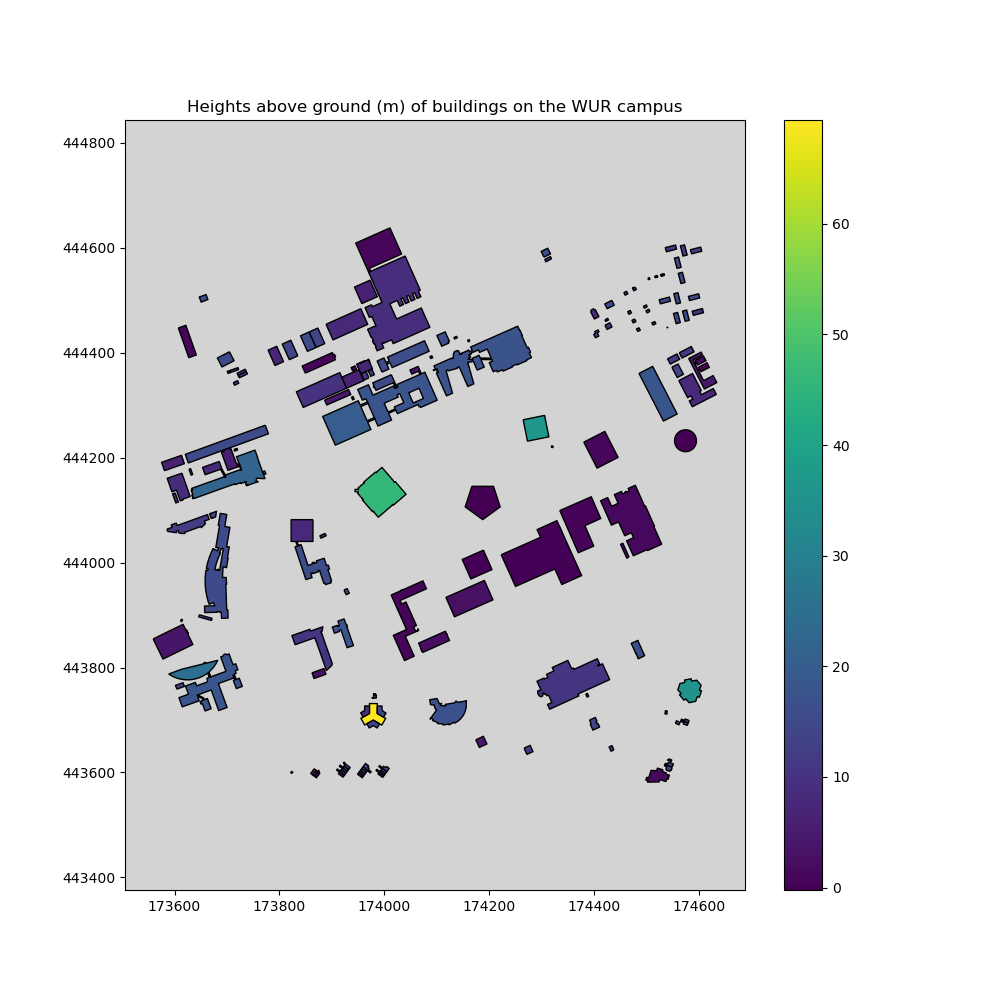
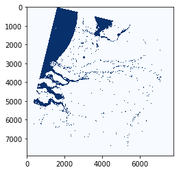
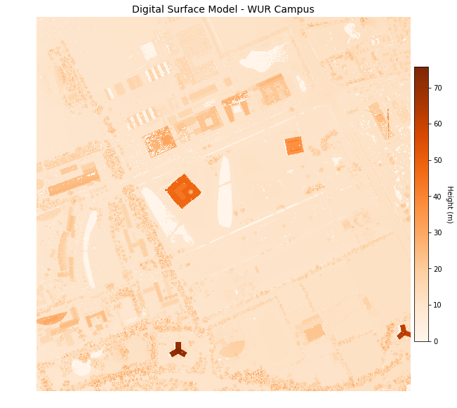
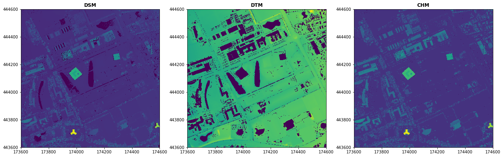
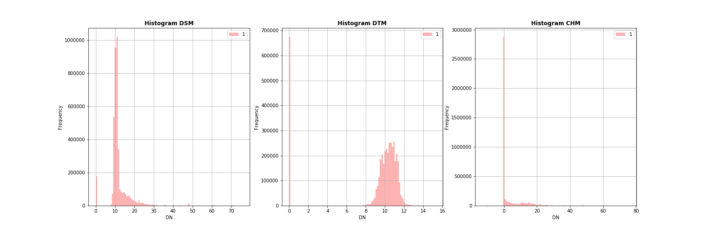

# [WUR Geoscripting](https://geoscripting-wur.github.io/) 

_Jan Verbesselt, Jorge Mendes de Jesus, Aldo Bergsma, Dainius Masiliunas, David Swinkels, Corné Vreugdenhil_ - `r format(Sys.time(), '%d %B, %Y')`

# Handling Raster data with Python

## Intro

Howdy. Good morning. Today we will be playing with Python packages for spatial raster analysis.
Python has some dedicated packages to handle rasters:

* [Rasterio](https://Rasterio.readthedocs.io/en/latest/) reads and writes geospatial raster data
* [NumPy](http://www.numpy.org/) is fundamental package for scientific computing, such as array calculations
* [rasterstats](https://pythonhosted.org/rasterstats/) summarizes geospatial raster datasets based on vector geometires
* [OWSLib](https://geopython.github.io/OWSLib/) to download geospatial raster data from Web Coverage Services
* [Matplotlib](https://Matplotlib.org/) for publication quality plotting
* [GDAL](https://en.wikipedia.org/wiki/GDAL) is powerful library for reading, writing and warping raster datasets
* [PySAL](https://pysal.readthedocs.io/en/latest/) is library for spatial analysis functions

Start up a new terminal and create a new environment with Python 3.6, Spyder and some useful Python packages to handle raster data.

```{r, engine = 'bash', eval=FALSE}
conda create -n rasterpython python=3.6 pip spyder
conda activate rasterpython
conda install -c conda-forge rasterio geopandas rasterstats matplotlib owslib pysal descartes
spyder
```

You should have just started Spyder with the correct conda environment. Did you notice what the code did?

> **Question 1**: What Python packages need to be installed from the conda-forge channel?

Rasterio is the main package we will use today. Before Rasterio there was one Python option for accessing the many different kind of raster data files used in the GIS field: the Python bindings distributed with the Geospatial Data Abstraction Library [GDAL]. These bindings extend Python, but provide little abstraction for GDAL’s C API. This means that Python programs using them tend to read and run like C programs. For example, GDAL’s Python bindings require users to watch out for dangling C pointers and potential crashers of programs. This is bad. Among other considerations Rasterio chose Python instead of C to avoid problems with pointers. Rasterio strives to use modern Python language features and idioms. Rasterio is about high performance, lower cognitive load, cleaner and more transparent code ([Rasterio, 2018](https://Rasterio.readthedocs.io/en/latest/intro.html)).

## Reading raster data with OWSLib and Rasterio

Raster data can be read from a file or from a Web Coverage Service [WCS]. Web Coverage Services load raster data in a similar way as Web Feature Services [WFS] load vector data. [Web Coverage Services](https://www.opengeospatial.org/standards/wcs) are a standard by the Open Geospatial Consortium and allow the downloading of geospatial raster data with multiple types of format encoding: GeoTIFF, netCDF, JPEG2000 etc. A [Web Map Service](https://www.opengeospatial.org/standards/wms) [WMS] allows downloading of images but without the data values. Web Map Services serve the map images as visualizations. 

Today we will work with some height rasters. Have a look at the Web Coverage Service of the AHN dataset. AHN stands for "Actueel Hoogtebestand Nederland" and is a Digital Elevation Model [DEM] that covers the Netherlands. Access the web coverage service to have a look at the contents.

```{r, engine = 'python', eval=FALSE}
from owslib.wcs import WebCoverageService
wcs = WebCoverageService('http://geodata.nationaalgeoregister.nl/ahn2/wcs?service=WCS', version='1.0.0')
print(list(wcs.contents))
```

The Web Coverage Service of the AHN2 has four contents: 0.5m interpolated, 0.5m not interpolated, 0.5m rough and 5m. The meters identify the cell size. Raster data of AHN has the projected coordinate system RD_New (EPSG: 28992). 


```{r, engine = 'python', eval=FALSE}
print([op.name for op in wcs.operations])
```


The Web Coverage Service can be accessed for it's data (GetCoverage), metadata (DescribeCoverage) or capabilities (GetCapabilities). These are all standard protocols defined by the OGC, which makes it easy to access the geodata via web services. Thank you Open Geospatial Consortium!


```{r, engine = 'python', eval=FALSE}
cvg = wcs.contents['ahn2_05m_ruw']
print(cvg.boundingBoxWGS84)
print(cvg.supportedCRS)
print(cvg.supportedFormats)
```

The metadata of each content is accessible. Supported formats for AHN are GeoTIFF with different data types. 

Let's have a look at the data. We don't want to overload the web service. So when we download once and store the data locally, we can use the data multiple times without having to call the web service again. Download the Digital Surface Model [DSM], which is the the 'ahn2_05m_ruw' version, and Digital Terrain Model [DTM], which is the 'ahn2_05m_int' version, to a local file. The difference between a DEM, DSM and DTM is explained on the [GIS StackExchange](https://gis.stackexchange.com/questions/5701/what-is-the-difference-between-dem-dsm-and-dtm/5704).

```{r, engine = 'python', eval=FALSE}
x, y = 174100, 444100
bbox = (x-500, y-500, x+500, y+500)
response = wcs.getCoverage(identifier='ahn2_05m_ruw', bbox=bbox, format='GEOTIFF_FLOAT32',
                           crs='urn:ogc:def:crs:EPSG::28992', resx=0.5, resy=0.5)
with open('./AHN2_05m_DSM.tif', 'wb') as file:
    file.write(response.read())

response = wcs.getCoverage(identifier='ahn2_05m_int', bbox=bbox, format='GEOTIFF_FLOAT32',
                           crs='urn:ogc:def:crs:EPSG::28992', resx=0.5, resy=0.5)
with open('./AHN2_05m_DTM.tif', 'wb') as file:
    file.write(response.read())
```

Reading the raster data with Rasterio is very straightforward.

```{r, engine = 'python', eval=FALSE}
import rasterio
DSM = rasterio.open("./AHN2_05m_DSM.tif", driver="GTiff")
DTM = rasterio.open("./AHN2_05m_DTM.tif", driver="GTiff")
print(DSM.meta)
print(DTM.meta)
```

The metadata shows us everything we need to know about the raster data. It shows the driver, datatype, nodata value, width of raster in cells, height of raster in cells, coordinate system and transformation values. This is very valuable information. We can notice that both of the Rasterio objects only have one raster layer. The raster layers can be read as NumPy arrays from the Rasterio object with the method `.read()`. 

```{r, engine = 'python', eval=FALSE}
print(type(DSM))
print(type(DSM.read(1)))

print(DSM.read(1))
```

On the backend of Rasterio the rasters are stored as NumPy arrays. This makes it easy to perform array calculations.


## Processing raster data

Rasterio can do advanced raster processing. It handles multiple bands, [masking](https://Rasterio.readthedocs.io/en/latest/topics/masking-by-shapefile.html), [reprojecting](https://Rasterio.readthedocs.io/en/latest/topics/reproject.html),  [resampling](https://Rasterio.readthedocs.io/en/latest/topics/resampling.html) and array calculations. Often rasters need to be combined to get to the information you need. A Canopy Height Model [CHM] can be created by simply subtracting a Digital Terrain Model from a Digital Surface Model. Each pixel in the CHM represents the tree overstory height above the underlying ground topography. Rasterio relies on NumPy to perform the array calcuations. Numpy arrays can be subtracted, added or indexed with multiple raster layers.

```{r, engine = 'python', eval=FALSE}
CHM = DSM.read() - DTM.read()
print(type(CHM))

kwargs = DSM.meta # Copy metadata of rasterio.io.DatasetReader
with rasterio.open('./AHN2_05m_CHM.tif', 'w', **kwargs) as file:
    file.write(CHM.astype(rasterio.float32))
```

The canopy height model gives an indication of the height of trees or buildings. Let's determine the height of individual buildings based on the height raster data. First step is to download building data from the BGT Web Feature Service, that we used yesterday.


```{r, engine = 'python', eval=FALSE}
import geopandas as gpd
import json
from owslib.wfs import WebFeatureService
bgtWfsUrl = 'https://geodata.nationaalgeoregister.nl/beta/bgt/wfs'
topographicalMapWFS = WebFeatureService(url=bgtWfsUrl, version='2.0.0')
responseBuildings = topographicalMapWFS.getfeature(typename='bgt:pand', bbox=bbox,
                                                   maxfeatures=100, outputFormat='json', startindex=0)
data = json.loads(responseBuildings.read())
buildingsGDF = gpd.GeoDataFrame.from_features(data['features'])
```


Next step is to perform zonal statistics to get the average height value per building vector. Rasterstats is a specific module for this task. It uses GeoDataFrames and .tif files and outputs [GeoJSON](http://geojson.org/), which is a standard geodata structure. 


```{r, engine = 'python', eval=FALSE}
import rasterstats as rs
CHMbuildings = rs.zonal_stats(buildingsGDF, "./AHN2_05m_CHM.tif", prefix='CHM_', geojson_out=True)
buildingsGDF = gpd.GeoDataFrame.from_features(CHMbuildings)
# check the added columns with a prefix 'CHM_'
print(buildingsGDF['CHM_mean'])
```


The GeoJSON can be read by GeoPandas, which makes it easy to access and visualize your data. A quick visualization shows us the heights derived from the raster data on the map.


```{r, engine = 'python', eval=FALSE}
import matplotlib.pyplot as plt
fig, ax = plt.subplots(1, figsize=(10, 10)) # Create one plot with figure size 10 by 10
ax.set_title('Buildings on the WUR campus and their heights above ground')
buildingsGDF.plot(ax=ax, column='CHM_mean', scheme='fisher_jenks', k=6, 
                  cmap=plt.cm.viridis, linewidth=1, edgecolor='black', legend=True)
ax.set_facecolor("lightgray") # Set background to grey
plt.axis('equal') # Set equal axis 
plt.show() # Visualize figure 
```



## Processing satellite images

Also, satellite imagery can easily be processed with Rasterio.  We prepared a Landsat image with all bands processed to surface reflectance (Level 1T). You can download it from [here](https://www.dropbox.com/s/zb7nrla6fqi1mq4/LC81980242014260-SC20150123044700.tar.gz?dl=0). Unzip the file and you will see that it contains all the invidual bands. Below we made a script to download the tarfile directly from the dropbox repository.

```{r, engine = 'python', eval=FALSE}
import os
import tarfile
from urllib.request import urlretrieve

directory = './data/'
tarfilename = directory + "landsat.tar.gz"

if not os.path.exists(directory):
    os.makedirs(directory)

if not os.path.isfile(tarfilename):
    url = 'https://www.dropbox.com/s/zb7nrla6fqi1mq4/LC81980242014260-SC20150123044700.tar.gz?dl=1'
    urlretrieve(url, tarfilename)
    tar = tarfile.open(tarfilename)
    tar.extractall(path=directory)
    tar.close()
```

Okay we have the satellite images. Let's calculate the Modified Normalized Difference Water Index [[MNDWI](https://www.researchgate.net/publication/232724072_Modification_of_Normalized_Difference_Water_Index_NDWI_to_Enhance_Open_Water_Features_in_Remotely_Sensed_Imagery)] for water body mapping. Values above 0 are water and values below 0 are not water. 

`MNDWI = (green - MIR) / (green + MIR)`

```{r, engine = 'python', eval=FALSE}
import numpy as np
import rasterio
from rasterio.plot import show

greenband = rasterio.open(directory + "LC81980242014260LGN00_sr_band4.tif")
mirband = rasterio.open(directory + "LC81980242014260LGN00_sr_band6.tif")

green = greenband.read(1).astype(float)
mir = mirband.read(1).astype(float)

np.seterr(divide='ignore', invalid='ignore')  # Allow division by zero
mndwi = np.empty(greenband.shape, dtype=rasterio.float32)  # Create empty matrix
check = np.logical_or(mir > 0.0, green > 0.0)  # Create check raster with True/False values
mndwi = np.where(check, (green - mir) / (green + mir), -999)  # Calculate MNDWI

water = np.where(mndwi > 0, 1, 0) # Set values above 0 as water and otherwise leave it at 0
show(water, cmap='Blues')
```



Since Rasterio uses numpy arrays, it is very easy to use numpy functions to help you. The np.logical_or computes the truth value of either of the two arrays. The np.where function returns the second or third argument if condition is correctly met.

## Writing raster data to file

To store the numpy array, Rasterio needs to combine metadata and the raster data. It is possible to use the metadata of the DSM or DTM that you had before, but the metadata can also be created from scratch. The CRS needs to be defined with a function from Rasterio and the transformation needs to be defined with Affine. Affine is a Python module that facilitates [affine transformations](https://www.quora.com/In-an-intuitive-explanation-what-is-an-affine-transformation-of-image), i.e. scaling, rotating, mirroring or skewing of images/rasters/arrays.

```{r, engine = 'python', eval=FALSE}
import affine
kwargs = {'driver': 'GTiff',
          'dtype': 'float32',
          'nodata': None,
          'width': 2000,
          'height': 2000,
          'count': 1,
          'crs': rasterio.crs.CRS({'init': 'epsg:28992'}),
          'transform': affine.Affine(0.5, 0.0, 173600.0, 0.0, -0.5, 444600.0)}
# kwargs = DSM.meta # Metadata can be copied from existing file if needed
with rasterio.open('./AHN2_05m_CHM.tif', 'w', **kwargs) as file:
    file.write(CHM.astype(rasterio.float32))
```

Rasterio developers recommend using GTiff as the driver, but rasterio can write most [raster formats from GDAL](https://www.gdal.org/formats_list.html). [The developers recommend using GeoTiff driver](https://github.com/mapbox/rasterio/issues/731) for writing as it is the best-tested and best-supported format. We can open the saved GeoTiff and check if the metadata is the same as we specified when writing data. Opening a file is very straightforward with Rasterio.

```{r, engine = 'python', eval=FALSE}
CHM = rasterio.open("./AHN2_05m_CHM.tif")
print(CHM.meta)
```


## Visualizing raster data

Raster data can be visualized by passing NumPy arrays to Matplotlib directly or secondly via a method in Rasterio that accesses Matplotlib for you. Visualizing directly with Matplotlib allows more flexibility - such as tweaking of the legend, axis or labels - and is more suitable for professional purposes. The visualization via Rasterio requires less code and can give a quick idea of your raster data. We will show both approaches. Let's make a geographical visualization of the DSM and DTM with Matplotlib. 

```{r, engine = 'python', eval=FALSE}
import matplotlib.pyplot as plt
fig, ax = plt.subplots(figsize=(10,10))
dsmplot = ax.imshow(DSM.read(1), cmap='Oranges', extent=bbox)
ax.set_title("Digital Surface Model - WUR Campus", fontsize=14)
cbar = fig.colorbar(dsmplot, fraction=0.035, pad=0.01)
cbar.ax.get_yaxis().labelpad = 15
cbar.ax.set_ylabel('Height (m)', rotation=270)
ax.set_axis_off()
plt.show()

fig, ax = plt.subplots(figsize=(10,10))
dtmplot = ax.imshow(DTM.read(1), cmap='Oranges', extent=bbox)
ax.set_title("Digital Terrain Model - WUR Campus", fontsize=14)
cbar = fig.colorbar(dtmplot, fraction=0.035, pad=0.01, extend='both')
cbar.ax.get_yaxis().labelpad = 15
cbar.ax.set_ylabel('Height (m)', rotation=270)
ax.set_axis_off()
plt.show()
```



If you don't like the orange colormap of Matplotlib, it is possible to change to [another colormap](https://Matplotlib.org/examples/color/colormaps_reference.html).

The second approach with Rasterio only requires one line of code to make a plot. By creating subplots, the figures can be combined.

```{r, engine = 'python', eval=FALSE}
from rasterio.plot import show
fig, (axdsm, axdtm, axchm) = plt.subplots(1, 3, figsize=(21, 7))
show(DSM, ax=axdsm, title='DSM')
show(DTM, ax=axdtm, title='DTM')
show(CHM, ax=axchm, title='CHM')
plt.show()
```



Rasterio can visualize simple histograms by calling functions of Matplotlib. 

```{r, engine = 'python', eval=FALSE}
from rasterio.plot import show_hist
show_hist(DSM, bins=100, lw=0.0, stacked=False, alpha=0.3, title="Histogram DSM")
show_hist(DTM, bins=100, lw=0.0, stacked=False, alpha=0.3, title="Histogram DTM")
show_hist(CHM, bins=100, lw=0.0, stacked=False, alpha=0.3, title="Histogram CHM")
```




# Exercise 12

The municipality of Wageningen wants to know the volume of each building on the campus. Work with a project structure and create well-structured scripts with one main script. Create several functions to derive the building volume of buildings on the campus:

* createBoundingBox
* writeGeotiffToFile
* getGeotiffFromWebCoverageService
* getDataFromWebFeatureService
* calculateBuildingVolume
* visualizeBuildingVolume

You will be reviewed mainly on the following three tasks and expected output:

1. Functions that provide the necessary functionality for this exercise.
2. Calculate the volumes (m3), per building and for all buildings together. Present result nicely summarized in one table.
3. A nice-looking map visualization of the buildings on the campus and include at least their volumes.

Optional bonus: Download the data if file does not exist already and store the file locally.
Double bonus: Divide buildings in relevant segments that, based on elevation data, significantly differ from each other within the same building.

Upload your well structured project to a GitLab repository.

## Extra info

  * [Landsat satellite images](https://earthexplorer.usgs.gov/)
  * [Resampled landsat satellite images](http://espa.cr.usgs.gov/index/)
  * [Sentinel satellite images](https://scihub.copernicus.eu/dhus/#/home)
  * [Tutorial working with rasters in Python with Rasterio](https://geohackweek.github.io/raster/04-workingwithrasters/)
  * [Tutorial working with raster in Python with GDAL](https://pcjericks.github.io/py-gdalogr-cookbook/raster_layers.html)
